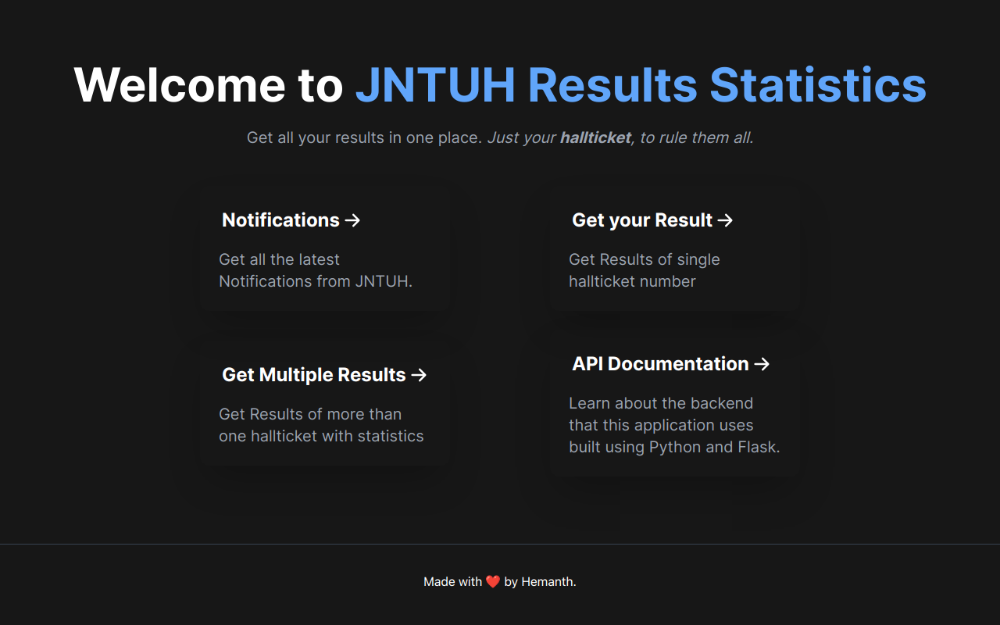

# [ JNTUH Results Statistics ](https://jntuh-results-stats.vercel.app)


<br>
<br>

<p align="center">
<code></code>
<code></code>
<code></code>
<code></code>
<code></code>
</p>

## Introduction

A place where you can get result(s) of all semesters, and regulations of
engineering undergraduates. All that you need is your hallticket to fetch the
results along with the SGPA for that specific exam. Along with fetching result
of a single hallticket, you can also fetch results of students given a
**_specific, valid range_** of hallticket numbers. This feature of the website
also provides you with basic statistics such as overall pass to failure
percentages and subject wise mean total marks.

## Features

- Filter the exam links as you want - Regulation(s), and Exam type. (The only
  reason why I started this project).
- **All R18 Results** - Results of all semesters of R18 regulation batch students in one shot.
- **Notifications** - Latest B.Tech exam results released notifications.
- **Single Student Result** - Ability to get result along with the SGPA of a single student provided the hallticket.
- **Results of Multiple Students** given a specific range of halltickets along with statistics such as
  - Overall pass/fail ratio of the given range of halltickets.
  - Bar chart representing each subject's pass to fail ratio along with mean total marks for eligible exams.


## Run Locally

Clone the project

```bash
git clone https://github.com/hemanth-kotagiri/jntuh-results-stats
```

Go to the project directory

```bash
cd jntuh-results-stats
```

Install dependencies

```bash
yarn install
```

Start the development server

```bash
yarn run dev
```

Run the production build

```bash
yarn run start
```

## API Documentation

Please visit the [API
Documentation](https://hemanth-kotagiri.github.io/sgpa-rest-api-docs) for
extensive details about the backend which is built using Python. Backend is
also Open-Source, feel free to check it out and contribute as well!

### Authors

- [@hemanth-kotagiri](https://www.github.com/hemanth-kotagiri)

## License

[GPL-3.0](./LICENSE)
