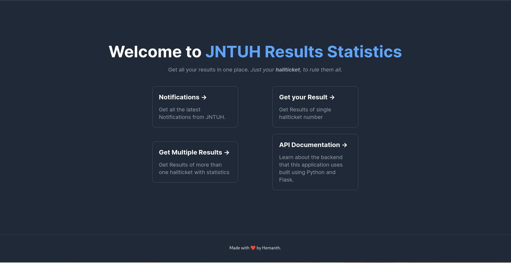
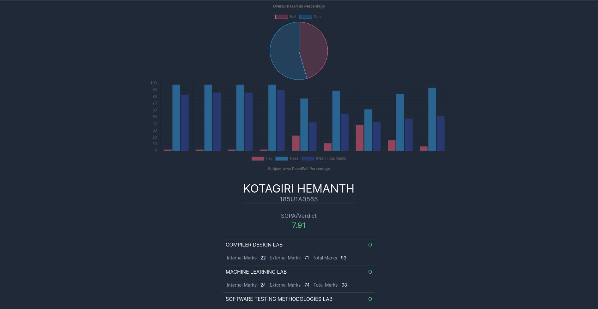

# JNTUH Results Statistics


<br>
<br>

<p align="center">
<code></code>
<code></code>
<code></code>
<code></code>
<code></code>
</p>

## Introduction

A place where you can get result(s) of all semesters, and regulations. All that
you need is your hallticket to fetch the results along with the SGPA for that
specific exam. Along with fetching result a single hallticket, you can also
fetch results of students given a **_specific, valid range_** of hallticket
numbers. This feature of the website also provides you with basic statistics
such as overall pass to failure percentages and subject wise mean total marks.

## Features

- Ability to filter the exam links as you want. (The only reason why I started this project).
- Result of a single student along with the SGPA calculated just by the hallticket number.
- Results of multiple students given a specific range of halltickets along with statistics.
  - Overall pass/fail ratio of the given range of halltickets.
  - Bar chart representing each subject's pass to fail ratio along with mean total marks for eligible exams.



## Run Locally

Clone the project

```bash
  git clone https://github.com/hemanth-kotagiri/jntuh-results-stats
```

Go to the project directory

```bash
  cd jntuh-results-stats
```

Install dependencies

```bash
  yarn install
```

Start the server

```bash
  yarn run dev
```

Start the production build

```bash
  yarn run start
```

## API Documentation

Please visit the [API
Documentation](https://hemanth-kotagiri.github.io/sgpa-rest-api-docs) for
extensive details about the backend which is built using Python. Backend is
also Open-Source, feel free to check it out and contribute as well!

### Authors

- [@hemanth-kotagiri](https://www.github.com/hemanth-kotagiri)

## License

[GPL-3.0](./LICENSE)
